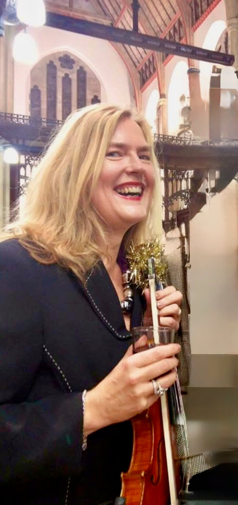
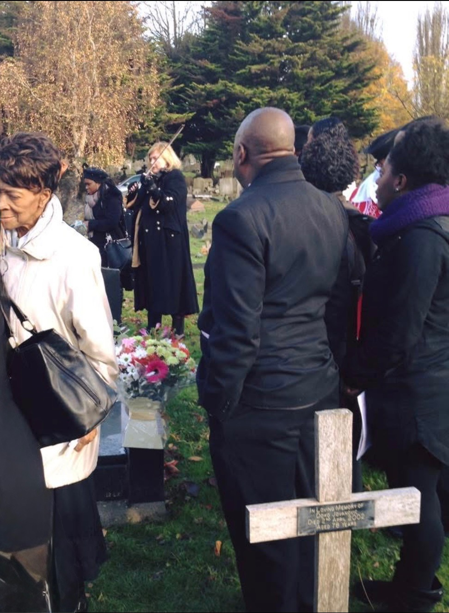
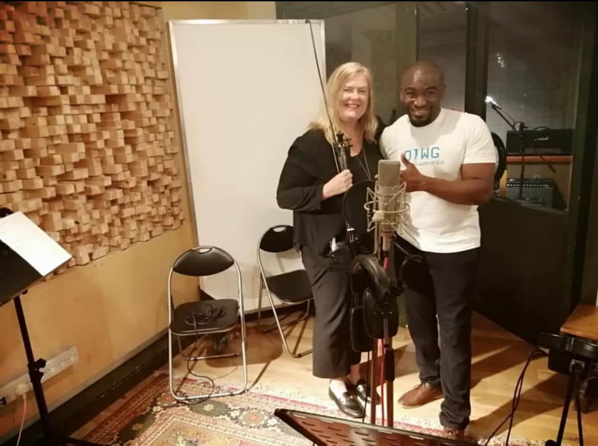
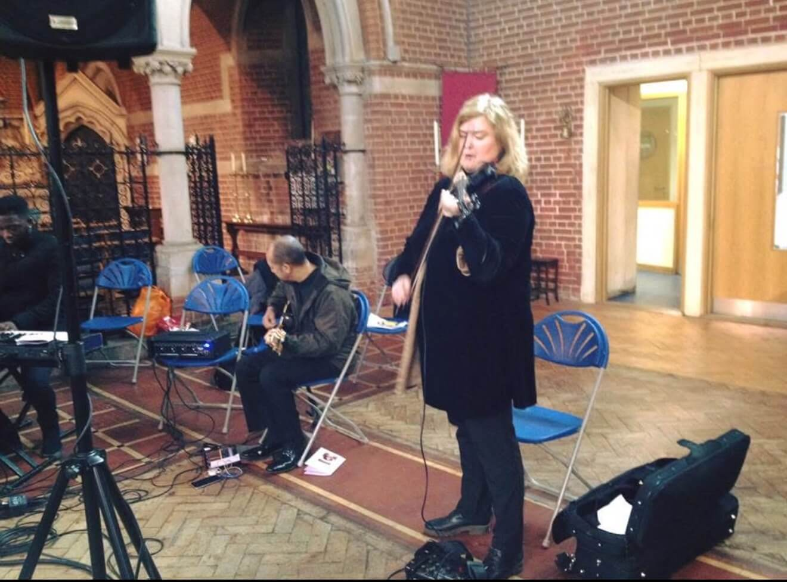
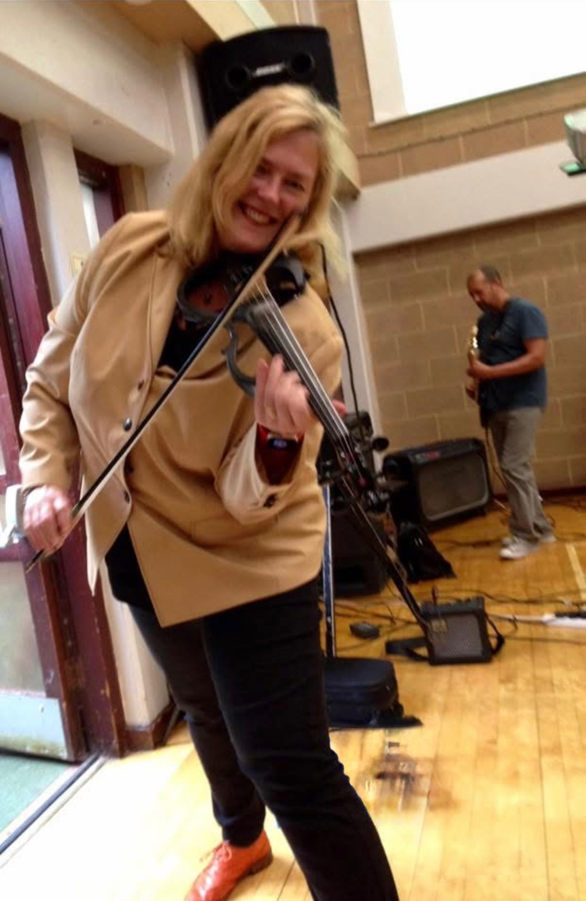

###############################################   index.html   ####################################################################

<!DOCTYPE html>
<html lang="en">
<head>
  <meta charset="UTF-8">
  <meta name="viewport" content="width=device-width, initial-scale=1.0">
  <title>Dorothe Blake | Professional Violinist for Weddings & Events</title>
  <meta name="description" content="Classically trained violinist with 40+ years experience. Available for weddings, funerals, and special events across London and Europe.">
  <meta name="keywords" content="violinist, wedding musician, event violinist, London violinist, classical musician">
  <meta property="og:title" content="Dorothe Blake | Professional Violinist">
  <meta property="og:description" content="Classically trained violinist for weddings and special events">
  <meta property="og:image" content="assets/IMG_0101.jpeg">
  <meta property="og:url" content="https://yourdomain.com">
  <link rel="stylesheet" href="css/style.css">
  <link rel="preconnect" href="https://fonts.googleapis.com">
  <link rel="preconnect" href="https://fonts.gstatic.com" crossorigin>
  <link href="https://fonts.googleapis.com/css2?family=Playfair+Display:wght@700&family=Open+Sans:wght@400;600&display=swap" rel="stylesheet">
  <link rel="stylesheet" href="https://cdnjs.cloudflare.com/ajax/libs/font-awesome/6.0.0/css/all.min.css">
  <link rel="icon" href="assets/favicon.ico" type="image/x-icon">
</head>
<body>
  <!-- Navigation -->
  <nav>
    <a href="index.html" class="logo" aria-label="Dorothe Blake Home">Dorothe Blake</a>
    <button class="mobile-menu-btn" aria-label="Menu" aria-expanded="false">
      <i class="fas fa-bars"></i>
    </button>
    

      <a href="#about">About</a>
      <a href="#history">Journey</a>
      <a href="#gallery">Gallery</a>
      <a href="#testimonials">Testimonials</a>
      <a href="#contact">Contact</a>
      <a href="booking.html" class="btn-gold">Book Now</a>
    

  </nav>

  <!-- Hero Section -->
  <header class="hero">
    
    

      <h1>Dorothe Blake</h1>
      
Professional Violinist for Weddings, Funerals & Special Events

      

        <a href="#contact" class="btn-gold">Contact Me</a>
        <a href="booking.html" class="btn-outline">Check Availability</a>
      

    

  </header>

  <!-- About Section -->
  <section id="about" class="bio">
    

      <h2>About Me</h2>
      

        

          
Classically trained violinist with over 40 years of performance experience across Europe and North America. I specialize in creating beautiful musical moments for:

          <ul class="performance-list">
            <li><i class="fas fa-heart"></i> Wedding ceremonies & receptions</li>
            <li><i class="fas fa-church"></i> Funeral services</li>
            <li><i class="fas fa-glass-cheers"></i> Corporate events</li>
            <li><i class="fas fa-pray"></i> Worship services</li>
          </ul>
          
My performances blend technical precision with emotional depth to perfectly complement your special occasion.

        

        

          
        

      

    

  </section>

  <!-- History Section -->
  <section id="history" class="history">
    

      <h2>My Musical Journey</h2>
      

        

          
1970s

          <h3>Early Beginnings</h3>
          
Began playing at age 7 in Rotterdam. Joined church worship teams and the Rotterdam Youth Symphony Orchestra by age 12.

        

        

          
1980s-1990s

          <h3>International Performances</h3>
          
Played with bands across Belgium and France, recording albums and ministering through music. Performed with the Christian Radio and TV Orchestra (Evangelische Omroep).

        

        

          
2000s-Present

          <h3>Current Work</h3>
          
Member of Brent Symphony Orchestra, session violinist, and active worship musician at HTB London. Performed at over 200 weddings and special events.

        

      

    

  </section>

  <!-- Testimonials Section -->
  <section id="testimonials" class="testimonials">
    

      <h2>Client Testimonials</h2>
      

        

          

            
"Dorothe's performance at our wedding was absolutely magical. She learned our special song perfectly and brought many guests to tears with her beautiful playing."

          

          

            
- Sarah & James, London

          

        

        

          

            
"The violin music at my mother's funeral was so moving and exactly what she would have wanted. Dorothe handled everything with such sensitivity."

          

          

            
- Michael, Surrey

          

        

      

    

  </section>

  <!-- Gallery Section -->
  <section id="gallery" class="gallery">
    

      <h2>Performance Gallery</h2>
      

        <!-- Images -->
        
        
        
        
        
        
        
        
        
        
        <!-- Videos -->
        

          <video controls preload="metadata">
            <source src="assets/672a614ab91c4020ce00495cccf18a4a.mp4" type="video/mp4">
            Your browser does not support the video tag.
          </video>
        

        
        

          <video controls preload="metadata">
            <source src="assets/96760b3242fd2ad4386567e08833bafb.mp4" type="video/mp4">
            Your browser does not support the video tag.
          </video>
        

        
        <!-- YouTube Video -->
        

          <iframe src="https://www.youtube.com/embed/s4g8ZGORYh4" 
                  title="Dorothe Blake violin performance" 
                  frameborder="0" 
                  allow="accelerometer; autoplay; clipboard-write; encrypted-media; gyroscope; picture-in-picture" 
                  allowfullscreen 
                  loading="lazy">
          </iframe>
        

      

    

  </section>

  <!-- Contact Section -->
  <section id="contact" class="contact">
    

      <h2>Get in Touch</h2>
      

        <form id="contact-form">
          

            <label for="name">Your Name</label>
            <input type="text" id="name" name="name" required>
          

          

            <label for="email">Email Address</label>
            <input type="email" id="email" name="email" required>
          

          

            <label for="event-type">Event Type</label>
            <select id="event-type" name="event-type">
              <option value="">Select an option</option>
              <option value="wedding">Wedding</option>
              <option value="funeral">Funeral</option>
              <option value="corporate">Corporate Event</option>
              <option value="other">Other</option>
            </select>
          

          

            <label for="message">Your Message</label>
            <textarea id="message" name="message" required></textarea>
          

          

            <button type="submit" class="btn-gold">Send Message</button>
            

          

        </form>
        

          <h3>Direct Contact</h3>
          <a href="https://wa.me/447768815926" class="whatsapp"><i class="fab fa-whatsapp"></i> WhatsApp: +44 7768 815926</a>
          <a href="tel:+447768815926" class="phone"><i class="fas fa-phone"></i> Call: +44 7768 815926</a>
          <a href="mailto:Dorothe@hotmail.co.uk" class="email"><i class="fas fa-envelope"></i> Email: Dorothe@hotmail.co.uk</a>
          
          

            
Follow me:

            <a href="https://www.instagram.com/dorotheblake" aria-label="Instagram"><i class="fab fa-instagram"></i></a>
            <a href="https://www.facebook.com/share/1EJr7LhvXg/" aria-label="Facebook"><i class="fab fa-facebook"></i></a>
            <a href="https://www.youtube.com/user/yourchannel" aria-label="YouTube"><i class="fab fa-youtube"></i></a>
          

          
          

            <h4>Pricing Information</h4>
            
Weddings start from Ł350

            
Funerals start from Ł250

            <a href="booking.html" class="btn-outline">Full Pricing Details</a>
          

        

      

    

  </section>

  <footer>
    

      

        
Dorothe Blake

        
Professional Violinist

      

      

        <a href="index.html">Home</a>
        <a href="#about">About</a>
        <a href="#gallery">Gallery</a>
        <a href="booking.html">Booking</a>
        <a href="#contact">Contact</a>
      

      

        
Based in London

        
Available UK-wide

        
International bookings considered

      

    

    

      
&copy; 2024 Dorothe Blake. All rights reserved.

      
<a href="privacy.html">Privacy Policy</a> | <a href="terms.html">Terms of Service</a>

    

  </footer>

  
</body>
</html>

########################################################  booking.html  ###############################################################

<!DOCTYPE html>
<html lang="en">
<head>
  <meta charset="UTF-8">
  <meta name="viewport" content="width=device-width, initial-scale=1.0">
  <title>Book Dorothe Blake | Professional Violinist</title>
  <meta name="description" content="Book Dorothe Blake for your wedding, funeral, or special event. Check availability and pricing.">
  <link rel="stylesheet" href="css/style.css">
  <link href="https://fonts.googleapis.com/css2?family=Playfair+Display:wght@700&family=Open+Sans:wght@400;600&display=swap" rel="stylesheet">
  <link rel="stylesheet" href="https://cdnjs.cloudflare.com/ajax/libs/font-awesome/6.0.0/css/all.min.css">
</head>
<body>
  <!-- Navigation -->
  <nav>
    <a href="index.html" class="logo">Dorothe Blake</a>
    <button class="mobile-menu-btn" aria-label="Menu" aria-expanded="false">
      <i class="fas fa-bars"></i>
    </button>
    

      <a href="index.html#about">About</a>
      <a href="index.html#history">Journey</a>
      <a href="index.html#gallery">Gallery</a>
      <a href="index.html#testimonials">Testimonials</a>
      <a href="index.html#contact">Contact</a>
      <a href="booking.html" class="btn-gold">Book Now</a>
    

  </nav>

  <main class="booking-page">
    <header class="booking-hero">
      
      

        <h1>Book Your Event</h1>
        
Fill out the form below to check availability and pricing

      

    </header>

    <section class="booking-info">
      

        <h2>Booking Process</h2>
        

          

            <i class="fas fa-calendar-check"></i>
            <h3>1. Check Availability</h3>
            
Use the calendar to see available dates and times for your event.

          

          

            <i class="fas fa-envelope"></i>
            <h3>2. Submit Inquiry</h3>
            
Provide details about your event and musical preferences.

          

          

            <i class="fas fa-music"></i>
            <h3>3. Confirm Booking</h3>
            
Receive a confirmation with contract and payment details.

          

        

      

    </section>

    <section class="booking-pricing">
      

        <h2>Pricing Guide</h2>
        

          

            <h3>Weddings</h3>
            
From Ł350

            <ul>
              <li>Ceremony music</li>
              <li>1 hour reception</li>
              <li>Custom song requests</li>
            </ul>
          

          

            <h3>Funerals</h3>
            
From Ł250

            <ul>
              <li>Ceremony music</li>
              <li>2 selected pieces</li>
              <li>Hymn accompaniment</li>
            </ul>
          

          

            <h3>Special Events</h3>
            
From Ł300

            <ul>
              <li>1-2 hour performance</li>
              <li>Classical or contemporary</li>
              <li>Background or featured</li>
            </ul>
          

        

        
* All prices are approximate. Final quote depends on event details and location.

      

    </section>

    <section class="booking-form-section">
      

        <h2>Check Availability</h2>
        

          <!-- Calendly Embed -->
          

          

          
          
          

            <h3>Prefer to discuss first?</h3>
            
Contact me directly to discuss your event requirements:

            <a href="tel:+447768815926" class="btn-outline"><i class="fas fa-phone"></i> Call: +44 7768 815926</a>
            <a href="https://wa.me/447768815926" class="btn-outline"><i class="fab fa-whatsapp"></i> WhatsApp</a>
            <a href="mailto:Dorothe@hotmail.co.uk" class="btn-outline"><i class="fas fa-envelope"></i> Email</a>
            
            

              <h4>Frequently Asked Questions</h4>
              <a href="#faq-1">What music styles do you play?</a>
              <a href="#faq-2">Do you travel outside London?</a>
              <a href="#faq-3">Can you learn specific songs?</a>
            

          

        

      

    </section>

    <section class="faq-section" id="faq">
      

        <h2>Frequently Asked Questions</h2>
        

          

            <h3>What music styles do you play?</h3>
            
I specialize in classical music but also perform contemporary, pop, jazz, and worship music. I'm happy to discuss your specific musical preferences for your event.

          

          

            <h3>Do you travel outside London?</h3>
            
Yes, I'm available for events throughout the UK. Travel costs may apply for locations outside Greater London.

          

          

            <h3>Can you learn specific songs?</h3>
            
Absolutely! I can learn up to 2 special requests for your event with sufficient notice (typically 4 weeks). Sheet music may be required for some pieces.

          

          

            <h3>How far in advance should I book?</h3>
            
For weddings, I recommend booking 6-12 months in advance, especially for peak season (May-September). For other events, 1-3 months notice is usually sufficient.

          

          

            <h3>What equipment do you bring?</h3>
            
I bring my own violin and can provide a small amplifier if needed for larger venues. For very large events, you may need to provide a PA system.

          

          

            <h3>What is your cancellation policy?</h3>
            
A 50% deposit is required to secure your date. Full refund if cancelled more than 3 months before the event. Details will be in your booking contract.

          

        

      

    </section>
  </main>

  <footer>
    

      

        
Dorothe Blake

        
Professional Violinist

      

      

        <a href="index.html">Home</a>
        <a href="index.html#about">About</a>
        <a href="index.html#gallery">Gallery</a>
        <a href="booking.html">Booking</a>
        <a href="index.html#contact">Contact</a>
      

      

        
Based in London

        
Available UK-wide

        
International bookings considered

      

    

    

      
&copy; 2024 Dorothe Blake. All rights reserved.

      
<a href="privacy.html">Privacy Policy</a> | <a href="terms.html">Terms of Service</a>

    

  </footer>

  
</body>
</html>

###################################################### script.js  #####################################################################

document.addEventListener('DOMContentLoaded', function() {
  // Mobile Menu Toggle
  const mobileMenuBtn = document.querySelector('.mobile-menu-btn');
  const navLinks = document.querySelector('.nav-links');
  
  if (mobileMenuBtn && navLinks) {
    mobileMenuBtn.addEventListener('click', function() {
      navLinks.classList.toggle('active');
      const isExpanded = this.getAttribute('aria-expanded') === 'true';
      this.setAttribute('aria-expanded', !isExpanded);
    });
    
    // Close mobile menu when clicking on a link
    document.querySelectorAll('.nav-links a').forEach(link => {
      link.addEventListener('click', () => {
        navLinks.classList.remove('active');
        mobileMenuBtn.setAttribute('aria-expanded', 'false');
      });
    });
  }

  // Smooth scrolling for anchor links
  document.querySelectorAll('a[href^="#"]').forEach(anchor => {
    anchor.addEventListener('click', function(e) {
      e.preventDefault();
      
      const targetId = this.getAttribute('href');
      const targetElement = document.querySelector(targetId);
      
      if (targetElement) {
        window.scrollTo({
          top: targetElement.offsetTop - 80,
          behavior: 'smooth'
        });
      }
    });
  });

  // Form submission handling
  const contactForm = document.getElementById('contact-form');
  if (contactForm) {
    contactForm.addEventListener('submit', function(e) {
      e.preventDefault();
      const formStatus = document.getElementById('form-status');
      
      // Show loading state
      formStatus.textContent = 'Sending...';
      formStatus.style.color = 'var(--medium-gray)';
      
      // Simulate form submission
      setTimeout(() => {
        formStatus.textContent = 'Message sent successfully!';
        formStatus.style.color = 'green';
        contactForm.reset();
        
        // Clear status after 5 seconds
        setTimeout(() => {
          formStatus.textContent = '';
        }, 5000);
      }, 1500);
    });
  }
  
  // Form validation
  const formInputs = document.querySelectorAll('#contact-form input, #contact-form textarea, #contact-form select');
  formInputs.forEach(input => {
    input.addEventListener('blur', function() {
      if (!this.checkValidity()) {
        this.style.borderColor = 'red';
      } else {
        this.style.borderColor = '#ddd';
      }
    });
  });
  
  // Animation on scroll
  const animateOnScroll = function() {
    const sections = document.querySelectorAll('section');
    sections.forEach(section => {
      const sectionTop = section.getBoundingClientRect().top;
      const windowHeight = window.innerHeight;
      
      if (sectionTop < windowHeight - 100) {
        section.style.opacity = '1';
        section.style.transform = 'translateY(0)';
      }
    });
  };
  
  // Initialize sections with fade-in effect
  document.querySelectorAll('section').forEach(section => {
    section.style.opacity = '0';
    section.style.transform = 'translateY(20px)';
    section.style.transition = 'opacity 0.6s ease, transform 0.6s ease';
  });
  
  // Run once on load
  animateOnScroll();
  
  // Then run on scroll
  window.addEventListener('scroll', animateOnScroll);
});

########################################################  style.css   ######################################################################

:root {
  --gold: #D4AF37;
  --gold-light: #E8C874;
  --black: #000000;
  --white: #FFFFFF;
  --gray: #F5F5F5;
  --dark-gray: #222222;
  --medium-gray: #888888;
  --section-padding: 100px;
  --container-width: 1200px;
}

/* Global Styles */
* {
  box-sizing: border-box;
  margin: 0;
  padding: 0;
}

body {
  font-family: 'Open Sans', sans-serif;
  line-height: 1.6;
  color: var(--black);
  background-color: var(--white);
  overflow-x: hidden;
}

h1, h2, h3, h4 {
  font-family: 'Playfair Display', serif;
  font-weight: 700;
  color: var(--dark-gray);
  line-height: 1.3;
}

h1 { font-size: 3rem; }
h2 { font-size: 2.5rem; margin-bottom: 1.5rem; }
h3 { font-size: 1.8rem; }
h4 { font-size: 1.4rem; }

p {
  margin-bottom: 1rem;
}

a {
  text-decoration: none;
  color: inherit;
}

img {
  max-width: 100%;
  height: auto;
  display: block;
}

.container {
  width: 100%;
  max-width: var(--container-width);
  margin: 0 auto;
  padding: 0 20px;
}

section {
  padding: var(--section-padding) 0;
}

.btn-gold {
  display: inline-block;
  background: var(--gold);
  color: var(--black);
  padding: 12px 24px;
  border: none;
  border-radius: 4px;
  font-weight: 600;
  cursor: pointer;
  transition: all 0.3s ease;
  text-align: center;
}

.btn-gold:hover {
  background: var(--gold-light);
  transform: translateY(-2px);
  box-shadow: 0 4px 8px rgba(0,0,0,0.1);
}

.btn-outline {
  display: inline-block;
  background: transparent;
  color: var(--white);
  padding: 12px 24px;
  border: 2px solid var(--white);
  border-radius: 4px;
  font-weight: 600;
  cursor: pointer;
  transition: all 0.3s ease;
}

.btn-outline:hover {
  background: rgba(255,255,255,0.1);
  transform: translateY(-2px);
}

/* Navigation */
nav {
  display: flex;
  justify-content: space-between;
  align-items: center;
  padding: 20px 5%;
  background-color: var(--white);
  box-shadow: 0 2px 10px rgba(0,0,0,0.1);
  position: fixed;
  width: 100%;
  z-index: 1000;
  top: 0;
}

.logo {
  font-family: 'Playfair Display', serif;
  font-size: 1.5rem;
  font-weight: 700;
  color: var(--black);
}

.nav-links {
  display: flex;
  gap: 30px;
}

.nav-links a {
  color: var(--black);
  transition: color 0.3s;
  font-weight: 600;
}

.nav-links a:hover {
  color: var(--gold);
}

.mobile-menu-btn {
  display: none;
  background: none;
  border: none;
  font-size: 1.5rem;
  cursor: pointer;
  color: var(--black);
  z-index: 1001;
}

/* Hero Section */
.hero {
  position: relative;
  height: 100vh;
  display: flex;
  align-items: flex-end;
  justify-content: center;
  text-align: center;
  color: var(--white);
  margin-top: 80px;
}

.hero-image {
  position: absolute;
  top: 0;
  left: 0;
  width: 100%;
  height: 100%;
  object-fit: cover;
  z-index: -1;
}

.hero-overlay-bottom {
  position: relative;
  background-color: rgba(0,0,0,0.7);
  padding: 40px;
  border-radius: 8px;
  width: 90%;
  max-width: 800px;
  margin-bottom: 50px;
  backdrop-filter: blur(2px);
}

.hero h1 {
  font-size: 3.5rem;
  margin-bottom: 15px;
  text-shadow: 0 2px 4px rgba(0,0,0,0.3);
}

.hero p {
  font-size: 1.3rem;
  margin-bottom: 30px;
  text-shadow: 0 1px 2px rgba(0,0,0,0.3);
}

.hero-buttons {
  display: flex;
  gap: 15px;
  justify-content: center;
  flex-wrap: wrap;
}

/* About Section */
.bio {
  text-align: center;
}

.bio-content {
  display: grid;
  grid-template-columns: 1fr 1fr;
  gap: 40px;
  align-items: center;
  margin-top: 40px;
}

.bio-text {
  text-align: left;
}

.bio-image {
  border-radius: 8px;
  overflow: hidden;
  box-shadow: 0 5px 15px rgba(0,0,0,0.1);
  transition: transform 0.3s ease;
}

.bio-image img {
  display: block;
  transition: transform 0.3s ease;
}

.bio-image:hover img {
  transform: scale(1.03);
}

.performance-list {
  list-style: none;
  margin: 20px 0;
}

.performance-list li {
  margin-bottom: 10px;
  display: flex;
  align-items: center;
  gap: 10px;
}

.performance-list i {
  color: var(--gold);
}

/* History Section */
.history {
  background-color: var(--gray);
}

.timeline {
  display: flex;
  flex-direction: column;
  gap: 30px;
  max-width: 800px;
  margin: 40px auto;
  position: relative;
}

.timeline::before {
  content: '';
  position: absolute;
  top: 0;
  bottom: 0;
  left: 50%;
  width: 2px;
  background: var(--gold);
  transform: translateX(-50%);
}

.timeline-item {
  background-color: var(--white);
  padding: 30px;
  border-radius: 8px;
  box-shadow: 0 3px 10px rgba(0,0,0,0.1);
  border-left: 4px solid var(--gold);
  position: relative;
  width: calc(50% - 30px);
}

.timeline-item:nth-child(odd) {
  align-self: flex-start;
}

.timeline-item:nth-child(even) {
  align-self: flex-end;
}

.timeline-date {
  position: absolute;
  top: -15px;
  left: -15px;
  background: var(--gold);
  color: var(--white);
  padding: 5px 15px;
  border-radius: 20px;
  font-weight: 600;
  box-shadow: 0 2px 5px rgba(0,0,0,0.2);
}

/* Testimonials Section */
.testimonials {
  background-color: var(--white);
}

.testimonial-grid {
  display: grid;
  grid-template-columns: repeat(auto-fit, minmax(300px, 1fr));
  gap: 30px;
  margin-top: 40px;
}

.testimonial-card {
  background: var(--gray);
  border-radius: 8px;
  padding: 30px;
  box-shadow: 0 3px 10px rgba(0,0,0,0.05);
  transition: transform 0.3s ease;
}

.testimonial-card:hover {
  transform: translateY(-5px);
}

.testimonial-content {
  font-style: italic;
  margin-bottom: 20px;
  position: relative;
}

.testimonial-content::before {
  content: '"';
  font-size: 3rem;
  color: var(--gold);
  position: absolute;
  top: -20px;
  left: -10px;
  opacity: 0.3;
}

.testimonial-author {
  font-weight: 600;
  color: var(--medium-gray);
}

/* Gallery Section */
.gallery {
  background-color: var(--gray);
}

.media-grid {
  display: grid;
  grid-template-columns: repeat(auto-fit, minmax(300px, 1fr));
  gap: 20px;
  margin-top: 40px;
}

.media-grid img, 
.media-grid .video-container {
  width: 100%;
  height: 300px;
  object-fit: cover;
  border-radius: 4px;
  overflow: hidden;
  box-shadow: 0 3px 10px rgba(0,0,0,0.1);
  transition: all 0.3s ease;
  position: relative;
}

.media-grid img:hover,
.media-grid .video-container:hover {
  transform: scale(1.02);
  box-shadow: 0 5px 15px rgba(0,0,0,0.2);
}

.video-container {
  position: relative;
  background: var(--black);
}

.video-container video,
.video-container iframe {
  width: 100%;
  height: 100%;
  object-fit: cover;
  border: none;
}

/* Calendly Widget Styling */
.calendly-inline-widget {
  min-width: 320px;
  height: 700px;
  border-radius: 8px;
  overflow: hidden;
  box-shadow: 0 3px 10px rgba(0,0,0,0.1);
}

/* Contact Section */
.contact {
  background-color: var(--white);
}

.contact-container {
  display: grid;
  grid-template-columns: 1fr 1fr;
  gap: 40px;
  margin-top: 40px;
}

#contact-form {
  display: flex;
  flex-direction: column;
  gap: 20px;
}

.form-group {
  display: flex;
  flex-direction: column;
  gap: 8px;
}

.form-group label {
  font-weight: 600;
}

#contact-form input,
#contact-form textarea,
#contact-form select {
  padding: 12px;
  border: 1px solid #ddd;
  border-radius: 4px;
  font-family: 'Open Sans', sans-serif;
  width: 100%;
}

#contact-form textarea {
  min-height: 150px;
  resize: vertical;
}

.form-submit {
  display: flex;
  flex-direction: column;
  gap: 10px;
}

.form-status {
  min-height: 20px;
  font-size: 0.9rem;
}

.direct-contact {
  display: flex;
  flex-direction: column;
  gap: 20px;
}

.direct-contact a {
  color: var(--black);
  display: flex;
  align-items: center;
  gap: 10px;
  transition: color 0.3s ease;
}

.direct-contact a:hover {
  color: var(--gold);
}

.direct-contact i {
  width: 20px;
  text-align: center;
}

.social-links {
  display: flex;
  gap: 15px;
  margin-top: 20px;
}

.social-links a {
  color: var(--black);
  font-size: 1.5rem;
  transition: color 0.3s ease;
}

.social-links a:hover {
  color: var(--gold);
}

.pricing-info {
  background: var(--gray);
  padding: 20px;
  border-radius: 8px;
  margin-top: 20px;
}

.pricing-info h4 {
  margin-bottom: 10px;
}

.pricing-info p {
  margin-bottom: 5px;
}

/* Footer */
footer {
  background-color: var(--dark-gray);
  color: var(--white);
  padding: 60px 0 0;
}

.footer-container {
  display: grid;
  grid-template-columns: repeat(auto-fit, minmax(250px, 1fr));
  gap: 40px;
  max-width: var(--container-width);
  margin: 0 auto;
  padding: 0 20px;
}

.footer-logo {
  font-family: 'Playfair Display', serif;
  font-size: 1.2rem;
  font-weight: 700;
}

.footer-links {
  display: flex;
  flex-direction: column;
  gap: 10px;
}

.footer-links a:hover {
  color: var(--gold);
}

.footer-bottom {
  text-align: center;
  padding: 20px;
  margin-top: 40px;
  border-top: 1px solid rgba(255,255,255,0.1);
}

.footer-bottom p {
  margin-bottom: 5px;
}

.footer-bottom a {
  color: var(--gold);
}

.footer-bottom a:hover {
  text-decoration: underline;
}

/* Booking Page Styles */
.booking-page {
  margin-top: 80px;
}

.booking-hero {
  position: relative;
  height: 60vh;
  display: flex;
  align-items: center;
  justify-content: center;
  text-align: center;
  color: var(--white);
  overflow: hidden;
}

.hero-background {
  position: absolute;
  top: 0;
  left: 0;
  width: 100%;
  height: 100%;
  object-fit: cover;
  z-index: -1;
}

.hero-overlay {
  background-color: rgba(0,0,0,0.6);
  padding: 40px;
  border-radius: 8px;
  max-width: 800px;
  margin: 0 auto;
}

.booking-hero h1 {
  font-size: 3rem;
  margin-bottom: 15px;
  text-shadow: 0 2px 4px rgba(0,0,0,0.3);
}

.booking-hero p {
  font-size: 1.3rem;
  margin-bottom: 30px;
  text-shadow: 0 1px 2px rgba(0,0,0,0.3);
}

/* Booking Info */
.booking-info {
  padding: 80px 0;
  background: var(--white);
}

.info-grid {
  display: grid;
  grid-template-columns: repeat(auto-fit, minmax(300px, 1fr));
  gap: 30px;
  margin-top: 40px;
}

.info-card {
  text-align: center;
  padding: 30px;
  border-radius: 8px;
  background: var(--gray);
  transition: transform 0.3s ease;
}

.info-card:hover {
  transform: translateY(-5px);
}

.info-card i {
  font-size: 2.5rem;
  color: var(--gold);
  margin-bottom: 20px;
}

.info-card h3 {
  margin-bottom: 15px;
}

/* Pricing Section */
.booking-pricing {
  padding: 80px 0;
  background: var(--gray);
}

.pricing-grid {
  display: grid;
  grid-template-columns: repeat(auto-fit, minmax(300px, 1fr));
  gap: 30px;
  margin-top: 40px;
}

.pricing-card {
  background: var(--white);
  padding: 30px;
  border-radius: 8px;
  box-shadow: 0 3px 10px rgba(0,0,0,0.05);
  text-align: center;
}

.pricing-card h3 {
  margin-bottom: 15px;
}

.price {
  font-size: 2rem;
  font-weight: 700;
  color: var(--gold);
  margin-bottom: 20px;
}

.pricing-card ul {
  list-style: none;
  text-align: left;
  margin-top: 20px;
}

.pricing-card li {
  margin-bottom: 10px;
  position: relative;
  padding-left: 25px;
}

.pricing-card li::before {
  content: '\f00c';
  font-family: 'Font Awesome 6 Free';
  font-weight: 900;
  position: absolute;
  left: 0;
  color: var(--gold);
}

.pricing-note {
  text-align: center;
  margin-top: 30px;
  font-style: italic;
  color: var(--medium-gray);
}

/* Booking Form Section */
.booking-form-section {
  padding: 80px 0;
  background: var(--white);
}

.booking-container {
  display: grid;
  grid-template-columns: 2fr 1fr;
  gap: 40px;
  margin-top: 40px;
}

.booking-contact {
  display: flex;
  flex-direction: column;
  gap: 20px;
}

.booking-contact .btn-outline {
  display: flex;
  align-items: center;
  justify-content: center;
  gap: 10px;
  color: var(--dark-gray);
  border-color: var(--dark-gray);
  margin-bottom: 10px;
}

.booking-contact .btn-outline:hover {
  background: var(--dark-gray);
  color: var(--white);
}

.faq-link {
  margin-top: 30px;
}

.faq-link h4 {
  margin-bottom: 15px;
}

.faq-link a {
  display: block;
  margin-bottom: 10px;
  color: var(--gold);
}

.faq-link a:hover {
  text-decoration: underline;
}

/* FAQ Section */
.faq-section {
  padding: 80px 0;
  background: var(--gray);
}

.faq-grid {
  display: grid;
  grid-template-columns: repeat(auto-fit, minmax(300px, 1fr));
  gap: 30px;
  margin-top: 40px;
}

.faq-item {
  background: var(--white);
  padding: 30px;
  border-radius: 8px;
  box-shadow: 0 3px 10px rgba(0,0,0,0.05);
}

.faq-item h3 {
  color: var(--gold);
  margin-bottom: 15px;
}

/* Responsive Design */
@media (max-width: 1024px) {
  :root {
    --section-padding: 80px;
  }
  
  .bio-content {
    grid-template-columns: 1fr;
    gap: 30px;
  }
  
  .bio-image {
    max-width: 500px;
    margin: 0 auto;
  }
  
  .timeline::before {
    left: 30px;
  }
  
  .timeline-item {
    width: calc(100% - 30px);
    margin-left: 30px;
  }
  
  .booking-container {
    grid-template-columns: 1fr;
  }
  
  .booking-hero {
    height: 50vh;
  }
  
  .calendly-inline-widget {
    height: 600px;
  }
}

@media (max-width: 768px) {
  :root {
    --section-padding: 60px;
  }
  
  h1 { font-size: 2.5rem; }
  h2 { font-size: 2rem; }
  
  .hero h1 {
    font-size: 2.5rem;
  }
  
  .hero p {
    font-size: 1.1rem;
  }
  
  .contact-container {
    grid-template-columns: 1fr;
  }
  
  .mobile-menu-btn {
    display: block;
  }
  
  .nav-links {
    position: fixed;
    top: 80px;
    left: 0;
    width: 100%;
    background: var(--white);
    flex-direction: column;
    align-items: center;
    padding: 20px 0;
    box-shadow: 0 5px 10px rgba(0,0,0,0.1);
    transform: translateY(-150%);
    transition: transform 0.3s ease;
  }
  
  .nav-links.active {
    transform: translateY(0);
  }
  
  .hero-overlay-bottom {
    padding: 20px;
    margin-bottom: 30px;
  }
  
  .hero-buttons {
    flex-direction: column;
    align-items: center;
  }
  
  .btn-gold,
  .btn-outline {
    width: 100%;
  }
  
  .booking-hero h1 {
    font-size: 2.5rem;
  }
  
  .booking-hero p {
    font-size: 1.1rem;
  }
  
  .booking-info, 
  .booking-pricing,
  .booking-form-section,
  .faq-section {
    padding: 60px 0;
  }
  
  .calendly-inline-widget {
    height: 500px;
  }
}

@media (max-width: 480px) {
  :root {
    --section-padding: 50px;
  }
  
  h1 { font-size: 2rem; }
  h2 { font-size: 1.8rem; }
  
  .hero h1 {
    font-size: 2rem;
  }
  
  .timeline-item {
    padding: 20px;
  }
  
  .info-grid,
  .pricing-grid,
  .faq-grid {
    grid-template-columns: 1fr;
  }
  
  .booking-hero h1 {
    font-size: 2rem;
  }
  
  .calendly-inline-widget {
    height: 400px;
  }
}

